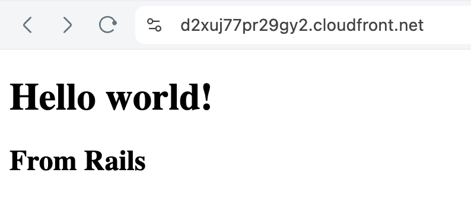

# Rails on AWS Fargate with Terraform
 


## Architecture

See the [Terraform code](./infra/main.tf) for the full architecture.

- A VPC with public, private, private isolated subnets
- An ECS cluster with a Fargate service
- A Route 53 private hosted zone for the ECS service (AWS CloudMap/Service Discovery)
- API Gateway w/ VPC Link Integration to the ECS service using the private DNS name
- An ECS task definition with a container that runs the Rails app
- A CloudFront distribution with an API Gateway origin

## Deploy to AWS with Terraform

First, you need to install Terraform. You can download it from [here](https://www.terraform.io/downloads.html). You'll
also need Docker and the AWS CLI installed and configured with your AWS credentials.

Next, create an [SSM parameter](https://docs.aws.amazon.com/systems-manager/latest/userguide/systems-manager-parameter-store.html)
with the Rails master key at `/rails-tf-example/prod/RAILS_MASTER_KEY`. Your master key can be found in the `config/master.key` file.
This key is used to decrypt the Rails credentials file in the ECS task definition.

```bash
cd infra
# Initialize the Terraform providers
terraform init
# See the changes that will be applied
terraform plan
# Apply the changes to your default AWS profile
terraform apply
```

You can also use a different AWS profile by setting the `TF_VAR_AWS_PROFILE` environment variable.

```bash
TF_VAR_AWS_PROFILE=my-profile terraform apply
```